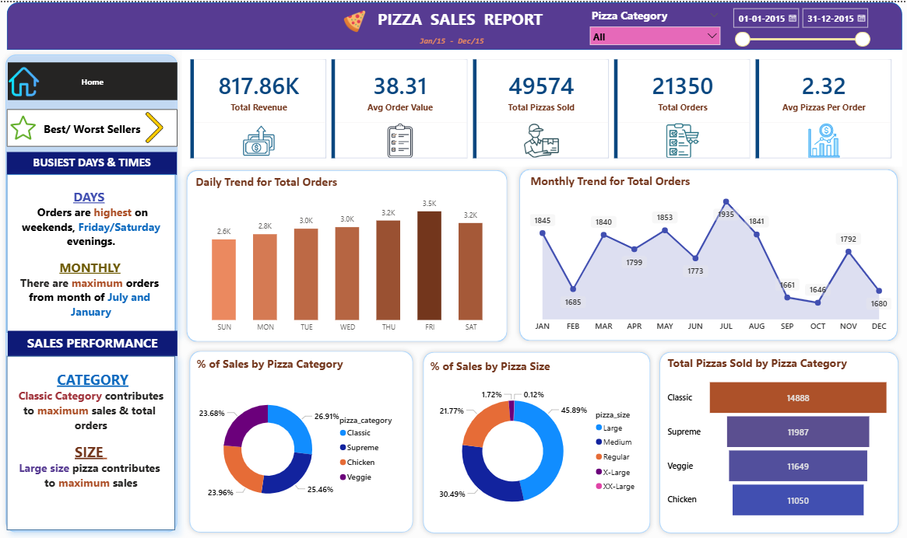
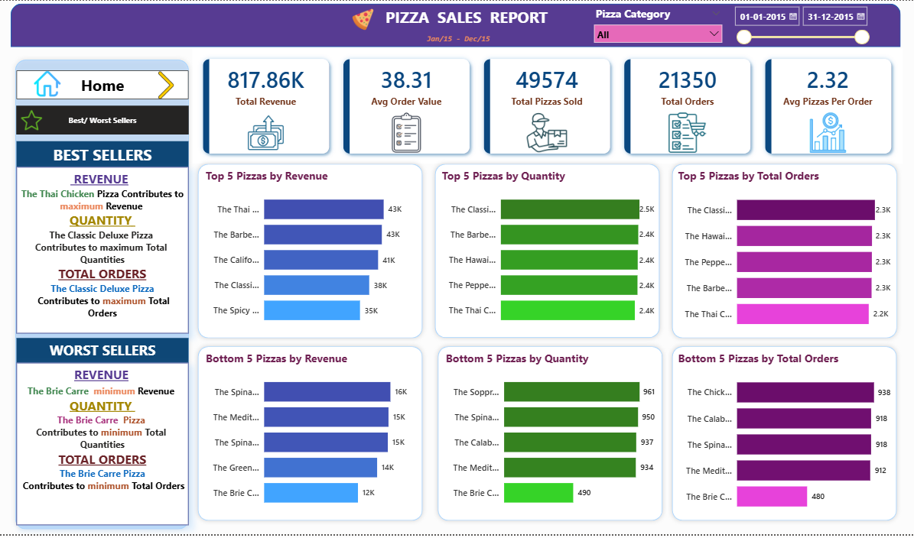

# 🍕 Pizza Sales Analysis Dashboard

## 📊 Project Overview

### This project analyzes pizza sales data using **Power BI** to generate business insights.
### The dashboard provides an interactive view of revenue performance, product trends, and sales distribution to support **data-driven decision making**.

---

## 🚀 Key Features

### 📈 Total Revenue and Order Analysis
### 📊 Daily and Monthly Sales Trends
### 🍕 Top 5 and Bottom 5 Selling Pizzas
### 📦 Sales Distribution by Category and Size
### 🔮 Revenue Forecasting and Growth Analysis

---

## 🛠 Tools & Technologies

### 🐍 Python (for data handling)
### 🗄 SQL (for KPI queries and analysis)
### 📊 Power BI (dashboard development)
### 📈 Data Visualization

---

## 📌 Key KPIs

### 💰 Total Revenue
### 🧾 Total Orders
### 📦 Total Pizzas Sold
### 📊 Average Order Value
### 🍕 Average Pizzas per Order

---

## 📷 Dashboard Preview

### Home Dashboard

### Best & Worst Sellers

---

## 📊 Insights Generated

### ✔ Classic category contributes the highest revenue
### ✔ Large pizza size drives maximum sales
### ✔ Weekends show the highest order volume
### ✔ Seasonal trends identified through monthly sales analysis

---

## 🎯 Project Goal

### To demonstrate **end-to-end data analysis and business intelligence skills** by transforming raw sales data into actionable insights using **Power BI dashboards**.

---

# ✨ **"Data is not just numbers — it tells the story of decisions, trends, and opportunities waiting to be discovered."**

---
